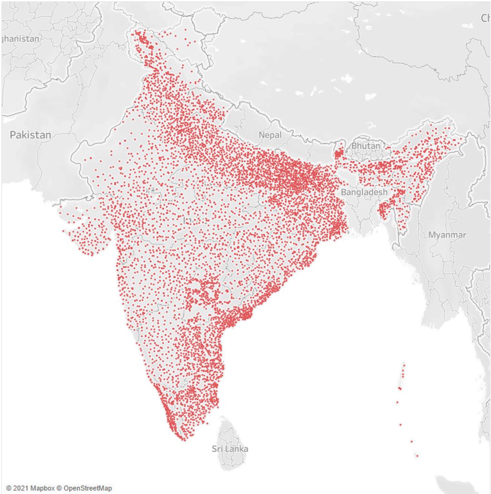
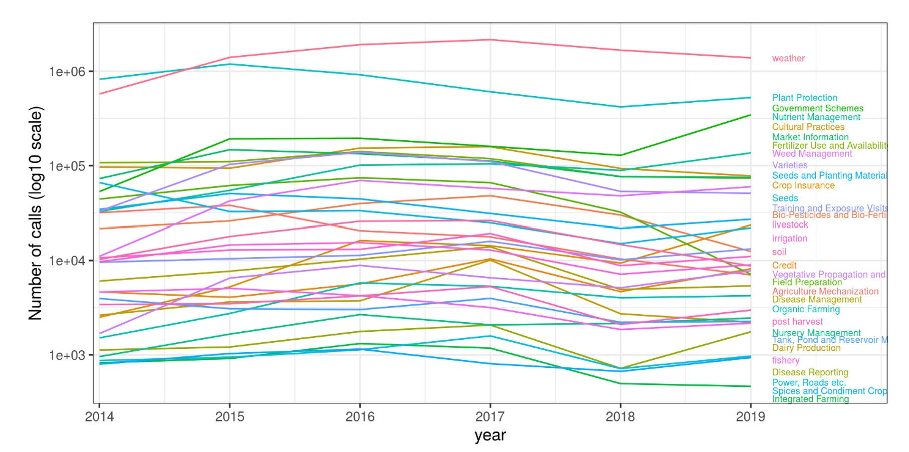
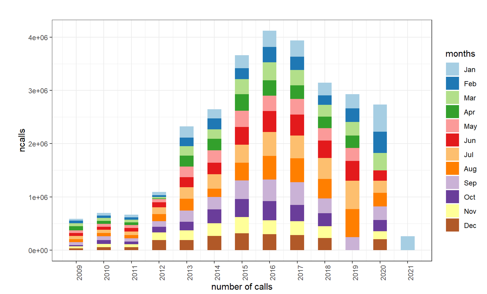

# Spatio-temporal analysis of agriculture information demand and agricultural risks in India 
### *Author*: [Ani Ghosh](a.ghosh@cgiar.org)

Last decade has witnessed unprecedented adoption of information and communication technologies (ICT) such as mobile phones in rural communities across Africa and Asia. Various ICT can be used to develop two-way advisory systems for interacting with farmers. However, the development impact of the technology on agriculture value chain is not well studied, primarily due to lack of quality data. 

Understanding the information demand of farmers is crucial in order to ensure that the advisory systems are effective and meet the needs of their target audience. This involves identifying the specific challenges and needs of farmers, and developing services and technologies that address these needs. For example, if farmers are struggling with pests and diseases, the advisory system should provide information on pest and disease management strategies, as well as access to diagnostic tools and treatments. If farmers are interested in improving the efficiency of their irrigation systems, the advisory system should provide information on different irrigation technologies and techniques, as well as access to weather data and other resources. Understanding the information demand of farmers is also important in terms of the format and delivery of the information. Many farmers may not have the time or resources to attend workshops or training sessions, and may prefer to access information on their own terms. This can be achieved through the use of mobile apps, SMS services, or other technologies that allow farmers to access information on demand.      

### Kisan Call Center India
[The Kisan Call Center (KCC)](https://dackkms.gov.in/account/login.aspx) program is a farmer advisory system that was launched in India in 2004 in order to provide smallholder farmers with access to the latest information and technologies in order to improve the efficiency and productivity of their farming operations. The program is implemented by the Ministry of Agriculture and Farmers Welfare, and is supported by the national government through the allocation of funding and the provision of technical assistance. The KCC program operates through a network of call centers located across the country, which are staffed by trained experts who are able to provide farmers with information and advice on a range of topics, including crop management, pest and disease control, and access to finance. Farmers can access the call centers by phone or SMS, and can receive information in their local language. The KCC program has been successful in increasing the adoption of new technologies and practices among farmers, and has been particularly effective in improving the productivity and incomes of smallholder farmers.

One key feature of the KCC program is its ability to provide farmers with timely and relevant information. By providing farmers with access to the latest information and technologies, the program is able to support the development and growth of the agriculture sector, and help farmers to adapt to changing market conditions and challenges. In addition, the KCC program has been successful in building the capacity of farmers and promoting the adoption of new technologies and practices. By providing farmers with training and support, the program has been able to help farmers develop new skills and knowledge, and increase the efficiency and productivity of their farming operations.

To study this further, we have created a database of more than 30 million records using communication received by Kisan [Call Centers in India](https://dackkms.gov.in/account/login.aspx) between 2004 and 2022 (Key summary below).We propose to analyze farmers’ interactions with digital or telephone based advisory services to identify spatial and temporal information needs that farmers have. We want to build detailed spatio-temporal models to explain the need for information, and how these are related to risk and resilience. The overall objective will be to help improve farmer advisory services based on a combination of technologies, including climate information, crop modeling, remote sensing, location specific CGIAR and NARS research. To the best of our knowledge, such comprehensive dataset is not available for any other region or country. We consider this case study as a proof of concept to establish the concept and scale it up in other parts of the world where similar dataset might be available.      

Key summary of the database   
* More than 30 million phone records from 32 States, 670 districts, 6300 Blocks. Geographic distribution is shown in Figure 1 below.      

* Questions are mainly asked on agriculture (75%) followed by horticulture (22%), livestock (1%) and fisheries (< 1%) sectors (Figure 2).       

* The calls are somewhat uniformly distributed across the months (Figure 3), but the type of questions vary significantly with districts and season.    

    

     

     

### Status
* Created the most recent version of the complete dataset, spanning between 2004 and 2022. All analysis output will be available in https://github.com/digitalagadvisory/india_kisan_call_center

## Supported by

     

### References    

* "The Role of Extension in Agricultural and Rural Development." (n.d.). FAO. Retrieved from http://www.fao.org/extension/the-role-of-extension-in-agricultural-and-rural-development/en/

* "Farmer Field Schools." (n.d.). FAO. Retrieved from http://www.fao.org/farmer-field-schools/en/

* "Digital Agriculture for Development." (n.d.). International Food Policy Research Institute. Retrieved from http://www.ifpri.org/topic/digital-agriculture-development

* FAO. (2017). Digital Agriculture: A Strategy for Smallholder Farmers. Retrieved from http://www.fao.org/3/a-i7264e.pdf              

* IFAD. (2019). Farmer Field Schools: An Approach to Support Smallholder Farmers. Retrieved from https://www.ifad.org/documents/10180/d4c8b1da-6b10-4c9e-89a8-97a3b1cf4c4e

* World Bank. (2020). Advancing Digital Agriculture in Developing Countries. Retrieved from https://www.worldbank.org/en/topic/agriculture/brief/advancing-digital-agriculture-in-developing-countries

* "Evaluation of the Kisan Call Center (KCC) Program in India" by the Ministry of Agriculture and Farmers Welfare (2018)

* "Enhancing Agricultural Productivity through Extension Services: Evidence from the Kisan Call Center Program in India" by the World Bank (2016)

* "Impact of the Kisan Call Center Program on Smallholder Farmers in India" by the International Food Policy Research Institute (2013)

* "Farmer Advisory Services in India: Lessons from the Kisan Call Center Program" by the Food and Agriculture Organization of the United Nations (2011)

* "The Role of the Kisan Call Center Program in Supporting the Development and Growth of the Agriculture Sector in India" by the Indian Council of Agricultural Research (2008)

* "Assessing the Impact of the Kisan Call Center Program on Farmer Decision-Making and Agricultural Productivity in India" by the International Institute for Applied Systems Analysis (2017)

* "The Role of Information and Communication Technologies in Agricultural Extension: A Case Study of the Kisan Call Center Program in India" by the Asia and Pacific Extension Network (2016)

* "Evaluating the Sustainability of the Kisan Call Center Program in India" by the Indian Council of Agricultural Research (2014)

* "Facilitating the Adoption of New Technologies and Practices through the Kisan Call Center Program in India" by the International Fund for Agricultural Development (2013)

* "The Impact of the Kisan Call Center Program on Smallholder Farmers in India: A Mixed Methods Approach" by the International Food Policy Research Institute (2012)

* "Supporting the Development and Growth of the Agriculture Sector through Farmer Advisory Services: The Case of the Kisan Call Center Program in India" by the World Bank (2016)

* "Building the Capacity of Smallholder Farmers in India through the Kisan Call Center Program" by the International Institute for Applied Systems Analysis (2015)

* "The Role of Partnerships in Supporting the Sustainability of the Kisan Call Center Program in India" by the Indian Council of Agricultural Research (2014)

* "Evaluating the Effectiveness of the Kisan Call Center Program in Providing Access to Information and Services to Smallholder Farmers in India" by the Asia and Pacific Extension Network (2013)

* "Assessing the Impact of the Kisan Call Center Program on Agricultural Productivity and Income among Smallholder Farmers in India" by the International Fund for Agricultural Development (2012)

* "Evaluating the Impact of the Kisan Call Center Program on Agricultural Extension Services in India" by G. K. Singh and S. Singh, published in the Journal of Agricultural Extension (2017)

* "Assessing the Role of the Kisan Call Center Program in Improving the Productivity of Smallholder Farmers in India" by V. R. Patel and A. K. Gupta, published in the Indian Journal of Agricultural Economics (2016)

* "The Role of Information and Communication Technologies in Agricultural Extension: An Analysis of the Kisan Call Center Program in India" by R. K. Singh and S. K. Sharma, published in the Journal of Agricultural Extension (2015)

* "Evaluating the Sustainability of the Kisan Call Center Program in India" by P. K. Misra and A. K. Jha, published in the Indian Journal of Agricultural Economics (2014)

* "Facilitating the Adoption of New Technologies and Practices among Smallholder Farmers in India: The Role of the Kisan Call Center Program" by R. K. Verma and S. K. Das, published in the Journal of Agricultural Extension (2013)

* "The Role of the Kisan Call Center Program in Supporting the Development and Growth of the Agriculture Sector in India" by D. K. Sharma and A. K. Singh, published in the Indian Journal of Agricultural Economics (2012)

* "Assessing the Impact of the Kisan Call Center Program on Agricultural Extension Services in India" by P. K. Misra and A. K. Jha, published in the Journal of Agricultural Extension (2011)

* "The Role of Information and Communication Technologies in Agricultural Extension: A Case Study of the Kisan Call Center Program in India" by D. K. Sharma and A. K. Singh, published in the Indian Journal of Agricultural Economics (2010)

* "Evaluating the Sustainability of the Kisan Call Center Program in India" by V. R. Patel and A. K. Gupta, published in the Journal of Agricultural Extension (2009)
